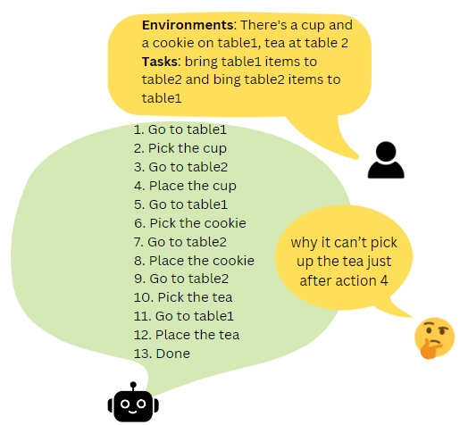
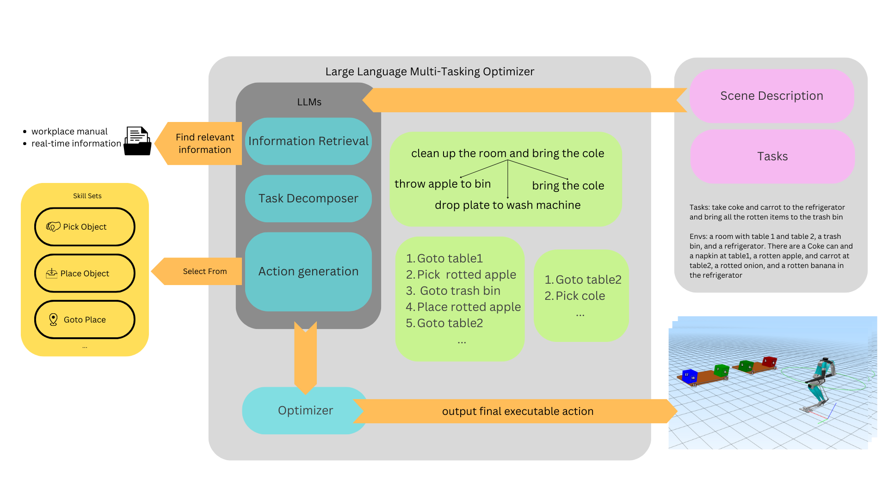
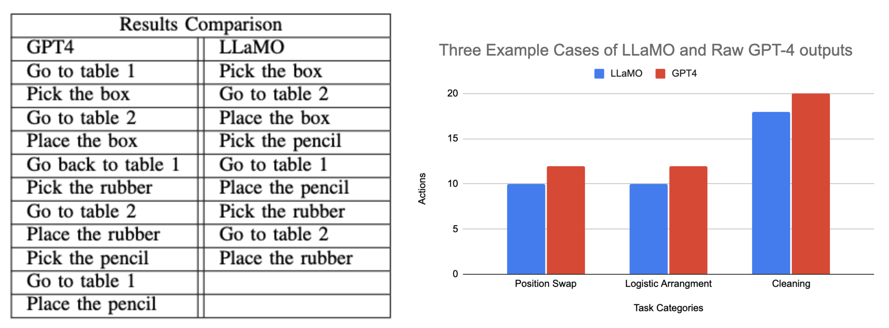

** Refer to the PDF for a better reading experience of our project report

# Robot Task Optimizer with Large Language Models

Contributors: Yuan Zhang, Apratim Banerjee, Shiyun Huang, Tianqi Zeng, Bike Zhang

## ABSTRACT
This project explores the challenges of utilizing Large Language Models (LLMs) for task planning within the robotics domain. While LLMs demonstrate potential in reasoning and action planning, their effectiveness diminishes in describing real-world scenarios and intricate instructions. The primary challenge addressed is the gap in the effectiveness of LLMs when applied to complex, real-world scenarios, particularly in robotics, where current LLM-based solutions often fail to optimize task sequences efficiently. In response, we introduce the Large Language Multi-tasking Optimizer (LLAMO), which capitalizes on the capabilities of advanced LLMs, such as GPT- 4, for task decomposition, models sequential dependencies, and integrates a graph optimization framework. Comprehensive testing on both simulated environments and hardware illustrates significant enhancements in planning efficiency.

## 1. INTRODUCTION

Large Language Models (LLMs) pre-trained on massive datasets have shown significantadvancements in many fields, including natural language processing, computer vision, image generation, etc. Such progress has also notably sparked a growing interest within the realm of robotics, particularly in the field of enhancing task understanding, motion planning, and execution capabilities. This integration aims to bridge the gap between high-level task comprehension and the nuanced execution of tasks by robots in dynamic and complex environments.

Recent work in LLM-based task planning often ignores the critical analysis and optimization of the output. Relying on the raw outputs of LLMs may not guarantee the desired levels of efficiency, repeatability, and accuracy in industrial engineering applications where reliability and long-horizon planning are critical. In this paper, we explore how large language models can be used to instruct a sophisticated full-sized Digit humanoid robot to perform long-horizon planning tasks correctly and efficiently. Our research builds upon recent successes in the application of LLMs, exemplified by GPT-4, for low-level control in robotics.

Inspired by this, we introduce the Large Language Multi-tasking Optimizer (LLaMO), a novel mechanism designed to harness the analytical ability of LLMs within complex scenarios, subsequently refining these insights through established optimization techniques. Our approach unfolds into three key parts. First, we employ a few-shot prompting strategy with state-of-the-art LLMs (e.g., GPT-4) to decompose complex tasks into manageable subtasks, each associated with corresponding actions. Next, we identify and model the sequential dependencies between actions at different subtasks (either by a deterministic function or learned neu- ral network such as Transformer). The final part involves mapping these relationships onto the graph, where the graph optimal solution is derived from calculating the shortest path through critical nodes. We have subjected our methodology to extensive tests in both simulated environments and real-world robots, recording notable enhancements in motion planning across various scenarios. Our contributions can be summarized as follows:
1) We propose LLaMO, a mechanism that enhances environmental analysis capabilities in robotics through the integration of LLM-based reasoning with graph optimization techniques.
2) The development of a Retrieval Augmentation Generation(RAG) based information retrieval module, enabling robots to adhere more effectively to workplace rules or real-time information.
3) Demonstrated improvements in both accuracy and efficiency, as evaluated by extensive testing on simulation and experiments with actual robots.

Fig 1: An example showing direct LLMs output lacks optimal solution

## 2. METHOD

To facilitate the generation of optimal action plans in response to complicated user commands, LLaMO employs a hierarchical strategy for task decomposition and integration. Upon receiving the command, the system evaluates the current environmental state and consults available knowledge relevant to these tasks. Utilizing LLMs’ capabilities and gathered information, the tasks are partitioned into discrete and manageable subtasks. Then, it generates specific actions while concurrently analyzing the information of these actions. All of these decompositions and analyses result in the later optimization process, which constructs the network of interdependent actions across different subtasks. The final part of this process is to utilize graph-theoretical optimization techniques to ascertain the most efficientsequence of actions, thereby determining the optimal solution path. An overview of our approach is shown in Fig. 2.

Fig. 2: Overview of LLaMO workflow. The framework processes user queries by retrieving necessary information and breaking down the main tasks into smaller, manageable ones for the LLM. It selects suitable skills to complete these subtasks, which are then optimized and transformed into executable robot commands.

1. Problem Formulation

The task planning problem can be formally defined within the framework of a given scene description S, the prior knowledge, and user-specified command C. The objective is to generate an optimal plan P ∗ that translates com- mand C into a coherent sequence of robotic actions A = {a1,a2,...,an}. An action ai ∈ A is characterized as the execution of a capability by the agent π, parameterized by arguments ρ = (ρ1,...,ρn), where the argument ρ is subject to objects in S. The set of capabilities Cπ for each agent, which encapsulates the programs for low-level action execution on the robot, would be dynamically determined at runtime based on the S.

Fig. 3: Components of the Optimizer and example illustration

We denote $$\( T = \{T_1, T_2, ..., T_m\} \)$$ as the set of sub-tasks generated from command \( C \) via few-shot prompting techniques with LLMs. Each subtask ( T_i) corresponds to a specific subset of actions, formulated to address the subtask effectively. For each \( T_i \), the task decomposition system identifies a set of viable actions \( A_i \) and assesses their applicability and impact, according to the current scene \( S \) and the external knowledge \( K \). This process is represented by the function:

$$ \[ A_i = f(T_i, K, S) \] $$

where \( f \) represents the analyzing operation performed by the LLMs to propose and evaluate potential actions.

For the further optimization step, we construct a directed graph \( G = (V, E) \), with vertices \( V \) symbolizing the actions and states and edges \( E \) delineating the transition between actions, factoring in availability which is derived from criteria such as efficiency, task rationality, and predetermined workplace regulations. The ultimate aim is to determine the most cost-effective path \( P^* \) within graph \( G \), minimizing the total cost Cost(P) while adhering to the constraints dictated by the environmental state \( S \) and the task specifications. Mathematically, the optimal path is obtained through the optimization:

$$\[ P^* = \text{arg min} \text{Cost}(P) \land T \in P^* \]$$

2. LLaMO Framework

We propose LLaMO, a mechanism designed to address complex and multi-task planning challenges through the integration of LLMs in a few-shot learning context combined with graph optimization methodologies. The ultimate goal of LLaMO is to interpret natural language instructions and convert them into executable commands that are aligned with the robot’s capabilities and specified parameters. The architecture of LLaMO is hierarchical, comprising four key components: an information retrieval system, a task decomposition module, an action generation mechanism, and an optimization framework. This structure enables LLaMO to efficiently process and act upon instructions, facilitating enhanced performance in robotic motion planning and task execution.

<li> Information Retrieval System: In the context of the LLaMO framework, the Information Retrieval component acts as the pivotal interface for integrating predefined work environment regulations, current robotic operational contexts, and user instruction, thereby providing up-to-date data to augment decision-making processes. For instance, when a robot detects a radiation warning symbol, this module ensures subsequent navigational strategies are recalibrated to eschew the marked area in adherence to the safety guidelines. This functionality leverages the Retrieval Augmentation Generation (RAG) architecture, which combines the strengths of traditional information retrieval techniques with the generative capabilities of state-of-the-art wording embedding, specifically utilizing OpenAI’s text-embedding-ada-002 for this study.
  
<li> The operational mechanism is composed as follows: preliminary to task execution, a preprocessing phase is applied to the external information, segmenting its content into discrete chunks. Each chunk is then encoded into vector form utilizing the aforementioned text embedding technology and stored within a database. Upon receiving a natural language instruction, alongside the assessments of the robot’s current operational environment, these inputs are processed through the same embedding technique. Subsequent retrieval is metricized by cosine similarity measures, with a selection of the Top-K highest-ranking documents. This information subsequently enriches the LLMs’ output, providing a richer understanding of the task’s condition and enabling more accurate decomposition and planning.

<li> Task Decomposition: Using the information gained from the previous section, LLaMO then systematically decomposes the complicated and multi-task instructions into a series of subtasks Ti. Each subtask Ti represents a portion of the work T that contributes towards achieving the final goals. This decomposition is guided by the LLM’s understanding of the task domain, the logical sequence of actions required, and the robot’s capabilities. Because some subtasks may have dependencies or need to be executed in a specific order, LLaMO also models the sequential and conditional dependencies between actions. This step ensures that the execution plan is coherent and logically structured, preventing conflicts and inefficiencies.

<li> Action Generation: The action generation module within LLaMO operates by analyzing subtasks into executable commands that are tailored to both the robot’s capabilities and the environmental conditions. This module informs itself of the robot’s abilities through in-context learning, and a series of examples are presented in the prompts to illustrate the robot’s skill sets. Subsequently, it maps the identified subtasks Ti to the robot’s skill set, ensuring that each action is feasible and aligned with the robot’s capabilities. Finally, it specifies the parameters of the chosen skill, which may be the target positions, object identifiers, etc. Specifically, it assigns each subtask Ti a critical node at the end of the action sequence, and reaching this critical usually indicates the finish of this subtask Ti. All of these critical nodes play a crucial role in the later shortest path optimization step.

<li> Optimizer: Inspired by the hierarchical structure of modern computer systems, which consists of components for information analysis, optimization, and final code generation, our proposed LLaMO adopts a similar framework. This hierarchical organization ensures efficient information gathering and utilization, leading to optimized solutions. Specifically, our optimizer consists of three key components: action data acquisition, sequential relation modeling, and shortest pathfinding optimization. This structure enables the systematic decomposition of complex tasks, modeling of dependencies between subtasks, and derivation of optimal solutions through graph optimization techniques.

Action Data Acquisition: In this module, all the actions of each subtask Ti are forwarded to the LLMs with the aim of predicting useful information during the execution of each subtask Ti, which involves monitoring the robot’s current location, its load condition, and the arrangement of items within the operational environment. This data collection serves as the foundation for the intricacies of task interdependencies that are thoroughly captured and exploited.

Sequential Relation Modelling: This phase focuses on developing sequential relationships, identifying actions that can be executed consecutively across different sub-tasks Ti. The actual implementation for establishing these links varies, supporting deterministic rules or adaptive algorithms learned from data. This approach changes the transition of action representations from a hierarchical structure to a more versatile graph-based structure, enhancing the representation of inter-task relationships and preparing for later optimization techniques.

Shortest Pathfinding Optimization: After constructing a comprehensive network comprising action nodes and their interconnections, our subsequent objective is to identify a feasible solution that minimizes cost while still adhering to certain task-specific requirements and constraints. To solve this, we implement a graph shortest path algorithm to ascer- tain the most efficient route through the critical nodes within the action graph. Specifically, in our subsequent experiments, we opt for Dijkstra’s algorithm to determine the shortest paths. The ultimate outcome is an optimized sequence of actions that efficiently accomplishes the intended tasks. The state transition of Dijkstra’s algorithm can be expressed by the following expression:

$$d(v,T) = min_{(u,v_{\text{min}}) \in E} [d(u,T') + \text{Cost}(u,v), \quad v \in T' \], d(u,T') + \text{Cost}(u,v), \quad v \notin T' \]\$$

where \( d(v,T') \) denotes the shortest path distance from the source to vertex \( v \), given the current node \( v \) and the set of completed subtasks is \( T' \). The function Cost(u,v) represents the weight of the edge connecting nodes \( u \) and \( v \). The goal is to find the minimum value of d(u,T') for all u ∈ T, which corresponds to the optimal solution.

## 3. RESULTS

We conduct experiments to answer the following questions:

Fig. 4: Example experiment under Agility simulator

1) Does LLaMO work for the real-world scenario?
2) How does its performance compare with other LLM-based task planning strategies?
3) To what extent the information retrieval part helps better understand the working environment?
4) Does the multi-task optimizer support dynamic optimiza- tion during operation?
5) Can LLaMO help robots plan with LLMs more efficiently on real robots?

### A.Simulation Experiment Setup

In our study, we leverage the GPT-4 model provided by OpenAI for all the experiments. To ensure the consistency and reliability of the results, we configured the model’s temperature parameter to zero and only used the top probability response. For our simulation environment, we selected the Agility humanoid robot and constrained the robot’s skill set to three fundamental operations: “Pick”, “Place”, and “Go To”. These operations were selected for their critical importance of humanoid robot working environments, like warehouses and logistics. We conducted validations of the robot’s output actions within the Agility simulator by designing appropriate environments. A series of prompts were formulated to implement the few-shot learning strategy, enabling GPT-4 to comprehend the robot’s operational context and its limited skill set efficiently.

Fig. 5: The right panel displays comparative results across three distinct categories, while the left panel details the outcomes of the position swap experiment

### B. Optimize Action Sequences

To more comprehensively evaluate the performance of our method in contrast to GPT-4 outputs, we conducted comparative experiments across three distinct categories. Furthermore, we present a detailed analysis of the outcomes in a specific case involving position swapping. The scenario is “a box and a rubber are located at table 1, and a pencil is at table 2”, with the task being to “swap the items’ positions between table 1 and table 2”. All the details are presented in Fig.5. GPT-4’s suggested processes included unnecessary steps, such as returning to table 1 from table 2 without transporting any items, a clear indication of process redundancy on the other side, LLaMO generates optimized procedures by eliminating such inefficiencies.

### C. Competitive Analysis

To further validate our method against other existing methods, we devised 10 test cases covering diverse aspects of robot planning, each with a different environment and task descriptions. We tested the accuracy and optimizing ability of LLaMO with raw GPT-4 output, LLM+P and Tree of Thought (ToT) methods. Each test case was tested 10 times on the same solver as LLM results might differ despite being given the same instructions. We tabulated the accuracy of each method tested on each test case.

An output is considered “correct” when the sequence of subtasks enables the robot to reach the goal specified in the query, the efficiency of the output action sequence is not taken into consideration in this experiment. If there is any mistake, for example, misplacing an item or trying to pick an item when the robot’s hands are not free, the output will be deemed as “wrong”. Table I below shows our result.

|Method|Average Success Rate|
| - | - |
|Raw GPT-4|80%|
|LLM+P|70%|
|Tree of Thought|90%|
|LLaMO|94%|

TABLE I: Average success rate of LLM models over 10 test cases.

With LLaMO framework, our method achieved the highest success rate in solving various test cases, including those with higher complexity which requires long-term planning and a good understanding of the dependencies of actions.

Fig. 6: Average number of action nodes from raw GPT-4, PDDL, ToT and LLaMO

|Results Comparison||
| - | :- |
|LLaMO with retrieval|LLaMO without retrieval|
|Go to desk|Go to desk|
|Pick beef soup|Pick curry|
|Go to table 3|Go to table1|
|Place beef soup|Place curry|
|Go to desk|Go to desk|
|Pick noodle|Pick noodle|
|Go to table 2|Go to table 2|
|Place the noodle|Place the noodle|
|Go to desk|Go to desk|
|Pick curry|Pick beef soup|
|Go to table1|Go to table3|
|Place curry|Place beef soup|

TABLE II: Output result comparison between GPT-4 and LLaMO.

Techniques such as the Tree of Thought have notably enhanced accuracy compared to the baseline GPT outputs. It is important to highlight that the LLM+P model exhibited the lowest success rate, indicating current LLM’s limitations in accurately modeling situations and queries to the PDDL (Planning Domain Definition Language) framework.

For test cases that were solved by all four methods with 100% accuracy, we counted the number of action nodes required to correctly perform the query to observe the optimizing capabilities of LLaMO. Fig. 6 depicts the average number of actions required for various methods to solve tasks. It is apparent that our method maintains superior performance compared to others. Notably, LLM+P also achieves commendable scores in this experiment, highlighting the significant potential of integrating traditional optimization techniques to enhance LLM outputs.

### D. Information Retrieval Experiment

Furthermore, we study the effectiveness of the information retrieval module on the appropriate decision-making capabilities. We conducted a series of experiments, testing the output actions’ difference between LLaMO with retrieval module and without. In our experiment, we start by collecting some external information that is designed for our experimental requirements. these would be then chunked as 200-size pieces, each converted into embeddings utilizing OpenAI’s text embedding API. When conducting a task query, both the content of the query and the scene description are converted into embeddings via the same API. We then identify the top 5 results based on cosine similarity and incorporate this information as the additional prompts provided to GPT-4. The core objective of our experiment is to ensure whether LLaMO could accurately identify the appropriate segment of text and subsequently generate the right actions based on this information. Table II is a typical example to demonstrate the output difference by applying the retrieval module. In this case, our task is to serve the meal to the customer and the scene description about what meal has been prepared and what each customer is waiting for. The additional information contains the waiting time for each customer, table 3’s customer with the longest waiting time, and table1’s get order recently. It can be seen from the output result that LLaMO with the retrieval module prioritizes the meal that has the longer waiting time, which better accommodates real-world scenarios.

### E. Simulation Experiment on Go1

Fig. 7: The left panel presents the visual layout of the maze, while the right panel shows a comparative analysis of action outcomes for navigating to specific maze locations.

To demonstrate the adaptability of LLaMO across a broad spectrum of robotic platforms, test robots with different capabilities. We set up an experiment with a quadruped robot, Go1, which represents a significant deviation from our initial models, with its primary function limited to locomotion. The experimental setup and results are depicted in Figure 6. When provided with coordinates for target locations, LLaMO demonstrates its capability to devise optimal navigation strategies.

### F. Hardware Testing on Go1

Furthermore, we test the system’s capability to optimize tasks dynamically, which incorporates the additional tasks during its operational phase. The specifics of this experiment are illustrated in Fig. 7. The initial task is to let the Go1 robot navigate a predetermined loop (A → B → C → D → A). In the middle of its operation, we introduce a supplementary task: directing the robot to point E. Initially, following the raw GPT-4 suggested action sequence, the robot would complete the original loop, returning to point A and then proceeding to point E. This approach is straightforward but also is far from efficient.

Leveraging LLaMO, we observe a significant optimization in the action sequence. The revised path directed the robot from point A to B, then B to C, diverging to point E, and subsequently returning from E to C. From there, it continued from C to D, and ultimately, from D back to A. This optimized route proved substantially more efficient than the initial strategy, underscoring LLaMO’s potential to enhance operational efficiency through intelligent task sequencing.

Fig. 8: Dynamic allocation of extra task during execution, without and with LLaMO

## 4. DISCUSSION

After validating our approach with these experiments, we next provide a discussion on what we learned and the limitations of the current approach.

1. Leveraging Hierarchical LLMs in Task Planning

It is interesting to note that hierarchical LLMs analysis plays a crucial role in robot task planning, we utilize the LLM to decompose task, generate action and analysis action information. All of these steps systematically leverage LLMs to generate in-depth information for to aid decision-making. Traditional LLM outputs, which typically adhere to an end-to-end format, often fall to deliver accurate and optimized sequences of actions. More than that, they usually fail to cooperate the environment with workplace rules and external information. However, by adopting a thoughtfully designed hierarchical structure, LLMs can substantially improve their success rates in executing complex task planning. This shift not only enhances the efficiency of LLMs in practical applications but also opens new avenues for exploring sophisticated models of decision-making and problem-solving. While we provide an example of the hierarchical task analysis , the structure for LLMs to do the task analysis is still under-explored.

2. Post-optimization Leads to Efficient LLM Output

Our experiment illustrates that the application of a post-optimization method significantly reduces unnecessary actions and redundancies in tasks. Unlike other optimization approaches that often overlook the potential interconnections between subtasks, our method uniquely identifies and leverages these links. By employing graph-theoretical optimization techniques, we effectively establish a connection between theoretical models and their real-world applicability, bridging the gap and enhancing overall task efficiency.

3. Limitation

The current framework exhibits several limitations. Firstly, it comes out when handling tasks with constraints. Specifically, our framework lacks a clear mechanism to determine if tasks are redundant or if they are left unaddressed due to constraints within the tasks. An illustrative example would be the tasks requiring the swapping of two tables’ positions, compounded by a constraint that restricts the maximum number of items permissible on a table. Sometimes, it may be necessary to move items to another table to mitigate this constraint. However, from our experiments, such actions might be treated as redundant tasks.

Another major limitation is the speed of inference in hierarchical LLMs, due to the extra steps compared with direct LLM outputs. Typically, robots spend some time formulating subsequent plans prior to action execution, which is generally acceptable. However, given that our framework supports task optimization during operational phases, the delay in awaiting further action outputs from the robot could present operational challenges.

## 5. CONCLUSION

Undoubtedly, the ChatGPT4 Large Language Model (LLM) stands as a potent tool, offering immense potential for analyzing and resolving complex problems that tradi- tionally demand significant human effort. However, during our extensive testing and experimentation, we discovered certain limitations in ChatGPT4’s ability to effectively guide robots through tasks. These limitations often manifested as redundancies and unnecessary complexities, hindering the efficiency and fluidity of task completion. Developing a solution that could harness the power of LLMs like GPT-4 while integrating advanced graph optimization methodologies seemed fruitful as our efforts to build LLaMO (Large Language Multi-tasking Optimizer) helped solve these chal- lenges.

The LLaMO system comprises four integral components: Retrieval Augmentation Generation (RAG), Task Decomposition, Action Generation, and Optimizer. These components effectively integrate regulations and user instructions, break down tasks into manageable sub-tasks, analyze sub-task information, generate optimized action plans to boost efficiency, and derive optimal solutions for task planning.

In our experiments, we showcased LLaMO’s superiority over other LLM-based task-planning methodologies, gauging its precision and efficiency across various test scenarios. Notably, we underscored LLaMO’s adeptness in environmental analysis and dynamic resource allocation, reinforcing its robustness and versatility through extensive testing on both agile humanoid robots and real quadrupedal robots.

The implications of our research extend far beyond the confines of the laboratory, promising to revolutionize long- term horizon task planning across a myriad of industries. By harnessing the computational prowess of LLMs like GPT-4, coupled with sophisticated optimization techniques, LLaMO offers unparalleled efficiency, repeatability, and accuracy in tasks ranging from logistics and distribution to manufac- turing and beyond. As we continue to refine and expand upon the capabilities of LLaMO, we envision a future where robots seamlessly integrate into various facets of human life, augmenting our capabilities and unlocking new frontiers of productivity and innovation.
